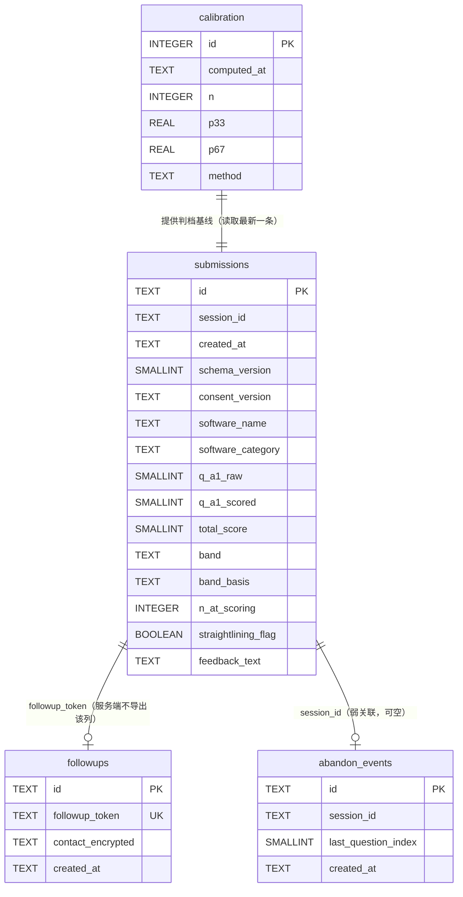

# 状态承载量自测工具 · 技术架构文档

- 撰写人：高见远（首席架构师）
- 日期：2026-09-09
- 状态：待评审（含 3 项 BLOCKING 前置问题，见第十节）
- 上游依据：`docs/PRD.md` v0.1（许清楚）
- 文档内不含 emoji；所有颜色值仅在 `tokens.css` 一处定义，业务代码禁止出现颜色字面量

---

## 零、给洪兄的三句话摘要

1. **架构与部署解耦**：后端是一套 Docker 化的极薄服务 + 单个 SQLite 文件，广州 Lighthouse / 境外轻量 / 云托管三者可互换。所以"要不要续费 Lighthouse"这个决定，可以推迟到备案问题查清之后，不阻塞开发。
2. **有一个比 Lighthouse 到期更硬的阻塞项**：国内节点绑域名需要 ICP 备案，而 CloudBase 默认域名会给访客弹"访问提示中间页"——分享到小黑盒/知乎的链接每来一个人就要点一次"确定访问"，转化率会崩。**这个问题必须先回答，否则选什么云都白搭。**
3. **伦理审查不阻塞上线**：本架构把"工具功能"和"数据采集"做成两个独立开关。IRB 未批准时，上线纯本地版（零采集、零数据、零风险）；批准后打开开关即可开始采集。同一个代码库，不用改。

---

## 一、架构总览

### 1.1 分层结构

```
┌──────────────────────────────────────────────────────────────┐
│  浏览器（Chrome / Safari / Firefox / 微信内置 X5）              │
│                                                                │
│  ┌────────────────────────────────────────────────────────┐  │
│  │  表现层  React 19 SPA（纯静态产物，可离线运行）           │  │
│  │  ┌──────────┐  ┌──────────┐  ┌──────────┐              │  │
│  │  │ 首页/选软件│→ │  9 题作答 │→ │  结果页   │              │  │
│  │  └──────────┘  └──────────┘  └────┬─────┘              │  │
│  │                                    │                     │  │
│  │  ┌─────────────────────────────────▼─────────────────┐  │  │
│  │  │  本地计算层（纯函数，0 网络往返）                    │  │  │
│  │  │  scoring.ts  反转 → 因子分 → 总分                   │  │  │
│  │  │  banding.ts  总分 + 分位基线 → 档位                 │  │  │
│  │  │  explain.ts  找出拉低分数的题 → 逐题解释            │  │  │
│  │  └─────────────────────────────────┬─────────────────┘  │  │
│  │                                    │                     │  │
│  │  ┌─────────────────────────────────▼─────────────────┐  │  │
│  │  │  collector.ts  采集客户端（可整体关闭，见 ADR-004）  │  │  │
│  │  │  - 仅在 config.collection_enabled = true 时发送     │  │  │
│  │  │  - 失败进 localStorage 队列，最多重试 3 次           │  │  │
│  │  │  - 失败绝不阻塞结果页渲染                            │  │  │
│  │  └─────────────────────────────────┬─────────────────┘  │  │
│  └────────────────────────────────────┼────────────────────┘  │
└────────────────────────────────────────┼───────────────────────┘
                                         │ HTTPS（异步，fire-and-forget）
┌────────────────────────────────────────▼───────────────────────┐
│  边缘层   Caddy / Nginx（自动 HTTPS、静态资源、反向代理）         │
├─────────────────────────────────────────────────────────────────┤
│  应用层   Node.js 22 + Fastify，3 个业务端点（约 400 行）         │
│           POST /api/v1/submissions     写入一条自测               │
│           GET  /api/v1/config          采集开关 + 分位基线        │
│           GET  /api/v1/admin/export    导出 CSV / JSON（鉴权）    │
├─────────────────────────────────────────────────────────────────┤
│  数据层   单个 SQLite 文件（WAL 模式），路径 /data/scc.db          │
│           submissions / followups / calibration / abandon_events │
├─────────────────────────────────────────────────────────────────┤
│  备份层   cron 每日 cp 快照 → /data/backups/scc-YYYYMMDD.db      │
│           保留 30 天；导出文件由研究者自行离线归档                 │
└─────────────────────────────────────────────────────────────────┘
```

### 1.2 三条架构判断

| # | 判断 | 理由 |
|---|------|------|
| 1 | **计分与判档全部在前端，后端只做 append-only 写入** | PRD 第十节要求"结果计算纯前端，0 网络往返"，同时这天然满足离线可用、结果页抗压、后端挂了也能用三个需求。后端挂掉的后果只是"丢数据"，不会"用户打不开结果" |
| 2 | **后端必须能整体关闭而不影响功能** | 这是把 IRB 风险从"阻塞项"降级为"配置项"的唯一手段。见 ADR-004 |
| 3 | **存储用单个 SQLite 文件，不用云数据库服务** | 研究数据是不可再生资产。单文件数据库 = 备份就是 `cp` 一个文件、导出就是一条 SQL、迁移就是 `scp`。任何托管数据库服务的"到期销毁"条款都是不可接受的风险（详见 2.4） |

---

## 二、存储与部署选型对比矩阵

### 2.1 先说那个决定一切的阻塞项：ICP 备案

这一条必须先讲清楚，因为它能一次性否掉两个看似最省事的方案。

**已核实的事实（来源：腾讯云 CloudBase 官方文档 `docs.cloudbase.net/service/alias` 与 `docs.cloudbase.net/service/introduce.html`）**：

1. CloudBase 为每个环境自动生成免费默认域名（`*.app.tcloudbase.com` 等），**无需备案即可访问**。
2. 但默认域名有**访问提示中间页**：浏览器直接访问时，访客必须先看到一个风险提示页，点"确定访问"才能进入实际页面。
3. 官方文档原文：「**建议仅在测试环境使用云开发"默认域名"。在生产环境使用默认域名可能因流量触发风控而被关停**」「严禁用于正式生产环境或**分发给大规模用户**」。
4. 移除中间页的唯一合规途径是配置自定义域名，而**自定义域名必须完成 ICP 备案**。
5. 在 CloudBase 内申请备案需同时满足三个条件：套餐为个人版及以上、云环境剩余有效期 > 6 个月、环境已开启云托管固定 IP。管局审核通常 **1–20 个工作日**。

**对本项目的含义**：本项目的第二身份是内容传播钩子，流量来自小黑盒 / 知乎 / 社群分享链接。如果每个访客点进来都要先过一个"确定访问"中间页，完成率和样本量会直接崩掉——样本量崩了，论文就没了。

**国内任何节点（含现有广州 Lighthouse）绑自定义域名，同样需要 ICP 备案。** 洪兄是澳门科技大学学生，是否持有已完成大陆 ICP 备案的域名，我无从判断。

> **这是本文档的 1 号 BLOCKING 问题，必须由洪兄本人回答。回答不同，部署目标完全不同（见 2.5 决策树）。**

### 2.2 候选方案

| 代号 | 方案 | 构成 |
|------|------|------|
| **A** | 复用现有广州 Lighthouse 自托管 | 现有实例（2核2G / 3Mbps / 广州）+ Caddy 或 Nginx + Node 容器 + SQLite |
| **B** | 腾讯云 CloudBase 云函数 + 云数据库 | 静态托管 + 云函数 + 云数据库，Serverless |
| **C** | 境外托管 Serverless（Supabase + Vercel） | Vercel 静态托管 + Supabase Postgres |
| **D** | 境外地域轻量服务器自托管 | 腾讯云/阿里云**香港或新加坡**地域轻量实例 + Caddy + Node 容器 + SQLite |

### 2.3 多维度对比

| 对比维度 | A. 广州 Lighthouse | B. CloudBase | C. Supabase + Vercel | D. 境外轻量（港/新） |
|---|---|---|---|---|
| **成本** | 续费约 99 元/年量级（同价续费档位，限 1 次）；**实际报价需登录控制台确认，不要信第三方文章价格** | 免费版 3,000 资源点/月（有效期 6 个月，需参与活动续期）；个人版 **19.9 元/月**（约 239 元/年） | Supabase Free $0，Pro **$25/月**；Vercel Hobby $0 | 境外地域实例月费通常与境内同配置同量级或略高；**具体以控制台报价为准** |
| **运维负担** | 中。需自管：系统更新、HTTPS 证书、容器重启、每日备份 cron。用 Caddy 自动 HTTPS 可显著减负 | 极低。无服务器，无证书运维 | 极低 | 中。同 A |
| **数据主权 / 可完整导出** | **最强**。单个 SQLite 文件在自有磁盘，`cp` 即备份，`sqlite3` 一条命令导出 CSV | **最弱**。套餐到期进入隔离期（官方条款：15 个自然日）后**自动销毁，数据清除且不可恢复**；数据库为文档型，导出格式非标准 | 好。标准 Postgres，可 `pg_dump`；但免费版 **7 天无活动自动暂停**，需手动恢复；数据在境外 | **最强**。同 A，单文件数据库 |
| **国内可访问性** | 优（国内节点，延迟最低）。**前提：已有备案域名** | 差（无备案时只能用带中间页的默认域名）；有备案域名则优 | **差**。境外节点，国内访问延迟与可用性均不稳定，存在打不开的风险 | 良。港/新到大陆通常可接受，**免备案**；不如国内节点稳 |
| **备案需求** | 需要（自定义域名） | 需要（自定义域名），且备案门槛更高（有效期 > 6 个月 + 固定 IP） | **不需要**（境外） | **不需要**（境外） |
| **上线速度** | 中。取决于续费与域名解析 | 中。取决于备案（1–20 工作日）；无备案则只能带中间页上线 | 快（无需备案） | 快（新购 + 部署约 1 小时） |
| **到期 / 断供风险** | **高**。**2026-09-15 到期，距今 6 天**，已关自动续费。忘记续费 = 整机停机 | **高**。到期 15 天后数据销毁；免费版 6 个月有效期需活动续期 | 中。免费版自动暂停；付费版无暂停 | 低。只要续费就在；且数据在自有磁盘，随时可迁走 |
| **与现有服务争抢资源** | **有**。该机已跑 new-api 中转站、imgbed、个人主页；2G 内存偏紧，且 new-api 若被刷会拖垮问卷写入 | 无 | 无 | 无（新机器，隔离） |
| **伦理审查表上怎么描述** | 简洁：「数据存储于研究者自有、位于中国境内的服务器」 | 需写「存储于腾讯云 CloudBase（服务商），地域 XX」 | 需写「存储于境外服务商」，**人类受试者数据处境可能引发额外审查** | 需写「存储于研究者自有、位于香港/新加坡的服务器」 |

### 2.4 加权评分

权重按本项目实际情况设定，不套用通用模板：

| 维度 | 权重 | 设定理由 |
|------|-------|---------|
| 数据资产安全性（不可丢、可完整导出、可长期留存） | 30% | 这是学位作品的命脉，丢了无法重来 |
| 国内可访问性（含备案可行性） | 25% | 决定能否拿到 200+ 样本 |
| 运维负担 | 20% | 洪兄要写论文，不会花时间维护服务器 |
| 上线速度 | 15% | 受学位时间表约束 |
| 成本 | 10% | 金额量级在几百元，不决定成败 |

评分 1–5 分，5 分最优：

| 维度（权重） | A | B | C | D |
|---|---|---|---|---|
| 数据资产安全性（30%） | 5 | 2 | 3 | 5 |
| 国内可访问性（25%） | 3* | 2* | 1 | 4 |
| 运维负担（20%） | 2 | 5 | 5 | 2 |
| 上线速度（15%） | 3 | 3 | 5 | 4 |
| 成本（10%） | 4 | 5 | 5 | 3 |
| **加权总分** | **3.50** | **3.05** | **3.40** | **3.80** |

\* A 与 B 的国内可访问性高度依赖"是否已有备案域名"。若已有备案域名，A = 5、B = 4，则 A 加权分为 **4.00**、B 为 **3.55**，A 反超为第一。这就是为什么它是 1 号 BLOCKING 问题。

### 2.5 推荐结论与决策树

**推荐：架构统一采用 A/D 同一套（Docker + SQLite），部署目标按下表分叉。**

```
                  ┌─────────────────────────────────────┐
                  │ 洪兄是否持有已完成 ICP 备案的域名？    │
                  └──────────────┬──────────────────────┘
                                 │
              ┌──────────────────┴──────────────────┐
              │ 是                                   │ 否 / 不确定
              ▼                                      ▼
   ┌──────────────────────┐            ┌──────────────────────────┐
   │ 方案 A：广州 Lighthouse│            │ 方案 D：境外地域轻量服务器  │
   │ （需 9-15 前续费）     │            │ （香港或新加坡，免备案）    │
   │ 国内最快 + 边际成本低  │            │ 国内可达 + 免备案 + 隔离   │
   └──────────────────────┘            └──────────────────────────┘
              │                                      │
              └──────────────────┬───────────────────┘
                                 ▼
                  同一套代码（docker-compose up -d）
                  同一个 SQLite 文件，随时可整机迁移
```

**为什么不推荐 B（CloudBase）**：三条理由，每一条单独都足以否决。
1. 无备案域名时只能用带中间页的默认域名，官方文档明确写了不适合分发给大规模用户——直接击中本项目传播命门。
2. 有备案域名时，备案门槛（剩余有效期 > 6 个月 + 固定 IP + 1–20 工作日审核）比自托管更高。
3. **套餐到期 15 天后自动销毁、数据不可恢复**（官方条款已核实）。把一份不可再生的学位研究数据放在一个"忘了续费就永久消失"的服务上，不可接受。

**为什么不推荐 C（Supabase + Vercel）**：
1. 国内访问可用性不可控。本项目受众是中文创意从业者，主要在大陆。
2. Supabase 免费版 **7 天无数据库活动即自动暂停**，需手动从控制台恢复。本项目的流量形态是"发一篇文章 → 一波流量 → 沉寂数周"，正好命中这个规则。
3. 数据存于境外服务商，涉及人类受试者数据处境，在伦理审查表上多一道解释成本。

### 2.6 Lighthouse 到期风险专项说明

| 情形 | 对本自测工具的影响 | 对其他服务的影响 | 建议动作 |
|---|---|---|---|
| **不续费（9-15 后释放）** | **零影响**。本架构不依赖该机（走方案 D，或等备案确认后再定） | **imgbed、new-api、个人主页全部停机**，且实例释放后数据不可恢复 | 若这三个服务还有价值，**必须在 9-15 前**做一次完整备份（整机快照 + 关键目录 `scp` 到本地）。这件事与本项目无关，但时间窗口只剩 6 天 |
| **续费** | 仅当"已有备案域名"成立时，才作为本项目部署目标（方案 A）。否则即使续费，本项目也不放上去 | 三个服务保住 | 续费报价**以控制台为准**；第三方文章中的"99 元/年"是同价续费活动档位，是否适用于该实例需自行确认 |
| **续费了但本项目不用它** | 它可作为**异地冷备份目标**：每周把 SQLite 快照同步一份上去。用上它的价值，但不成为单点故障 | — | 一条 `scp` cron，5 分钟配置 |

**结论**：Lighthouse 续不续费，是 imgbed / new-api 的生死问题，不是本项目的生死问题。请把这两件事分开决策，不要为了本项目去续费一台本来就打算放弃的机器。

---

## 三、数据模型设计

### 3.1 ER 图



### 3.2 表 `submissions`（一次自测 = 一行，宽表，直接对应导出 CSV 的一行）

| 字段 | 类型 | 必填 | 说明 |
|---|---|---|---|
| `id` | TEXT (UUIDv4) | 是 | 主键，服务端生成 |
| `session_id` | TEXT | 是 | 客户端生成的 UUIDv4，仅用于关联同一人连测多个软件。**不跨会话追踪**，关标签页即失效 |
| `created_at` | TEXT (ISO8601 UTC) | 是 | 服务端时间 |
| `client_submitted_at` | TEXT (ISO8601) | 否 | 客户端时间，允许存在偏差；用于诊断时区/时钟异常 |
| `schema_version` | SMALLINT | 是 | **题单版本**。8 题记为 1，9 题记为 2。题目数量或题面一旦变更必须递增，否则历史数据无法解释 |
| `max_score` | SMALLINT | 是 | 该版本满分（40 或 45），冗余存储，避免分析时依赖外部元数据 |
| `consent_version` | TEXT | 是 | 知情同意文本版本，如 `v1.0-2026-09` |
| `consent_mode` | TEXT | 是 | `implied`（告知—继续即同意）/ `explicit`（显式勾选） |
| `software_name` | TEXT | 是 | 用户输入的软件名，最长 60 字符，服务端做字符白名单清洗 |
| `software_name_norm` | TEXT | 是 | 小写、去空格、去标点后的归一化值，用于聚合统计 |
| `software_category` | TEXT | 是 | 枚举：`design` / `video` / `3d` / `doc` / `code` / `sheet` / `note` / `audio` / `other` |
| `is_custom_input` | BOOLEAN | 是 | 是否自由输入（非预设列表） |
| `q_a1_raw` … `q_c3_raw` | SMALLINT | 是 | **9 列**逐题原始分（1–5），不做任何变换 |
| `q_a1_scored` … `q_c3_scored` | SMALLINT | 是 | **9 列**反转后得分（反向题 = 6 − 原始分，正向题 = 原始分） |
| `factor_a_score` | SMALLINT | 是 | A 因子合计（3–15） |
| `factor_b_score` | SMALLINT | 是 | B 因子合计（3–15） |
| `factor_c_score` | SMALLINT | 是 | C 因子合计（3–15） |
| `total_score` | SMALLINT | 是 | **9–45**（若最终采用 8 题则为 8–40） |
| `band` | TEXT | 是 | 枚举：`high_risk` / `watch` / `safe` |
| `band_basis` | TEXT | 是 | 判档依据：`prior`（先验）/ `empirical_p33p67` / `kmeans`。**事后补不回来，必须存** |
| `n_at_scoring` | INTEGER | 是 | 判档时后端样本量。用于论文中说明"早期样本量不足时的档位为初步估计" |
| `s1_learning_type` | TEXT | 是 | S1 学习成本形态：`A` / `B` / `C`（不计入总分，作调节变量） |
| `s2_tenure_bucket` | TEXT | 是 | S2 使用年限分档：`lt6m` / `6m_2y` / `2y_5y` / `gt5y`（半开区间，与 openapi `Strata.S2` enum 同口径，建表加 CHECK 约束） |
| `s3_frequency_bucket` | TEXT | 是 | S3 每周使用频次分档：`daily` / `weekly_multi` / `weekly_once` / `monthly` / `rarer`（与 openapi `Strata.S3` enum 同口径，建表加 CHECK 约束） |
| `s4_adoption_type` | TEXT | 否 | S4 采纳方式：`self` / `mandated`（与 openapi `Strata.S4` enum 同口径；若最终采纳该选做题） |
| `duration_ms` | INTEGER | 是 | 从第一题渲染到提交的总时长 |
| `device_type` | TEXT | 是 | `mobile` / `desktop`。**由前端粗判后上报，服务端从不读取 UA** |
| `ua_family` | TEXT | 否 | `wechat` / `safari_mobile` / `other`。同样由前端上报 |
| `source` | TEXT | 否 | 渠道标记（UTM 或手工渠道名），渠道级，非个体级 |
| `region_bucket` | TEXT | 否 | **被试自愿填写**（见 3.6），不从 IP 推断 |
| `sequence_index` | SMALLINT | 是 | 本 session 内第几次自测。**PRD 明确要求，事后补不回来** |
| `straightlining_flag` | BOOLEAN | 是 | 9 题全选同一值 |
| `rapid_flag` | BOOLEAN | 是 | `duration_ms` 低于阈值（建议 12,000ms） |
| `quality_flags` | TEXT (JSON array) | 是 | 统一质量标记数组，便于后续扩展而不改表结构 |
| `feedback_text` | TEXT | 否 | F5 反驳入口文本 |
| `followup_token` | TEXT | 否 | 回访 token。**导出研究 CSV 时必须排除此列**（见 3.7） |
| `excluded` | BOOLEAN | 是 | 分析阶段人工标记剔除，默认 `false` |

### 3.3 表 `followups`（回访联系方式，物理分表）

| 字段 | 类型 | 说明 |
|---|---|---|
| `id` | TEXT (UUIDv4) | 主键 |
| `followup_token` | TEXT | 32 位随机 hex，客户端生成，唯一 |
| `contact_encrypted` | TEXT | 联系方式**加密存储**，密钥存于服务端环境变量，不进代码库 |
| `created_at` | TEXT | 写入时间 |
| `band` | TEXT | 冗余档位，用于分层回访，避免 join 主表 |
| `contact_purge_after` | TEXT | 承诺的删除/匿名化时间点 |

**分表原则**：本表不含 `session_id`、不含 `software_name`、不含任何答题内容。仅通过 `followup_token` 关联。**导出给统计分析的研究数据集中不得包含 `followup_token` 列**——否则 token 就退化成一个可用于跨表还原的伪标识符。

### 3.4 表 `calibration`（档位基线快照）

| 字段 | 类型 | 说明 |
|---|---|---|
| `id` | INTEGER | 主键 |
| `computed_at` | TEXT | 计算时间 |
| `schema_version` | SMALLINT | 对应题单版本 |
| `n` | INTEGER | 参与计算的样本量 |
| `p33` / `p67` | REAL | 经验分位值 |
| `method` | TEXT | `empirical` / `kmeans` |
| `cutpoints` | TEXT (JSON) | k-means 校准后的绝对切点（N ≥ 150 后启用） |

### 3.5 表 `abandon_events`（问卷设计诊断）

| 字段 | 类型 | 说明 |
|---|---|---|
| `id` | TEXT | 主键 |
| `session_id` | TEXT | 会话标识 |
| `schema_version` | SMALLINT | 题单版本 |
| `last_question_index` | SMALLINT | 在第几题退出 |
| `duration_ms` | INTEGER | 已用时长 |
| `created_at` | TEXT | 时间 |

该表同样属于人类受试者数据采集，受 `config.collection_enabled` 开关统一管控。

### 3.6 索引清单

MVP 阶段只建 4 个，不做复合索引（200–600 条数据量，全表扫描也在毫秒级）：

| 索引 | 字段 | 用途 |
|---|---|---|
| `idx_sub_created` | `created_at` | 按时间范围导出、分位计算 |
| `idx_sub_session` | `session_id` | 个体内比较、sequence 查询 |
| `idx_sub_software` | `software_name_norm` | 按软件聚合 |
| `idx_sub_version` | `schema_version` | 分版本统计 |

### 3.7 隐私最小化设计（逐条对应）

| 隐私威胁 | 处置 | 落地位置 |
|---|---|---|
| IP 地址可识别个人 | **IP 仅在内存中参与速率限制，绝不落库**。若确需持久化，只允许存 `HMAC-SHA256(ip, 每日轮换密钥)` 的前 16 位，且每日轮换使其无法跨天关联 | `security.ts`，落库字段列表中**没有** IP 相关字段 |
| User-Agent 指纹 | 服务端从不读取 UA 原文。设备类型与浏览器族由**前端粗判后上报**（只有 3 个取值，信息量极低） | 前端 `session.ts` |
| 跨会话追踪 | `session_id` 存 `sessionStorage`（关标签页即失效），提供"清除本次记录"入口；不使用 Cookie、不使用 localStorage 持久化身份 | 前端 |
| 地区推断 | **不从 IP 推断地区**。若论文确需地区变量，改为**被试自愿填写的下拉题**，不填即 `NULL` | `region_bucket` 字段 |
| 联系方式关联到答题 | 物理分表，仅 token 关联；导出研究数据集时排除 token 列 | `followups` 表 + 导出逻辑 |
| 自由文本中的身份信息 | `feedback_text` 长度上限 500 字符；导出前做一次正则扫描（手机号 / 邮箱 / 常见 ID 格式），命中则在导出报告中提示研究者人工复核 | `csv.ts` |
| 撤回权 | 因数据完全匿名、无法定位单条记录，**提交后技术上无法撤回**。这一点必须写进知情同意文本（IRB 标准表述），而不是在技术上假装可以撤回 | 知情同意文案 |
| 数据最小化 | 不采集：IP、UA 原文、Cookie、精确时间戳以外的任何环境信息、软件备注、屏幕分辨率、字体列表、Canvas 指纹 | 字段清单即边界 |

### 3.8 防重复刷量：分层机制

**核心原则：不拦截用户，只标记数据。** 因为 PRD 第二节画像 B 的核心行为是"连测 5–10 个软件"，拦截会直接杀死传播；而可疑数据可以在分析阶段用 `quality_flags` 剔除。这个取舍是刻意的。

| 层 | 机制 | 阈值（建议） | 是否落库 | 是否阻断 |
|---|---|---|---|---|
| 网络 | 单 IP 令牌桶（内存哈希） | 10 次/分钟、60 次/小时 | 否，仅内存 | 超限时返回 429 |
| 会话 | 单 `session_id` 每日条数 | 25 条/天 | 否 | 超限时返回 429 |
| 全局 | 全站每日写入上限（熔断器） | 2,000 条/天 | 否 | 超限后拒绝写入并告警 |
| 客户端 | 同会话两次提交最小间隔 | 5 秒 | 否 | 前端直接不发 |
| 内容 | 软件名校验：长度 ≤ 60、字符白名单、重复字符 ≤ 10 | — | 否 | 拒绝 |
| 内容 | 蜜罐字段 `hp`（CSS 隐藏的输入框，正常用户看不到） | 非空即拒 | 否 | 拒绝 |
| 行为 | `duration_ms` < 12,000 | — | 是（`rapid_flag`） | 否，仅标记 |
| 行为 | 9 题取值全部相同 | — | 是（`straightlining_flag`） | 否，仅标记 |
| 分析 | 同 session 同 `software_name_norm` 重复提交 | — | 是（`dup_flag`） | 否，仅标记 |

**不用图形验证码**：验证码会显著降低完成率（本项目对完成率极度敏感），且引入第三方 JS 意味着引入又一个可能处理个人数据的主体。前端答题时长 + 蜜罐字段的组合，对这个量级的项目足够。

### 3.9 导出设计（面向 SPSS / R / Python）

导出端点：`GET /api/v1/admin/export?format=csv|json&shape=wide|long&include=`（需 `X-Admin-Token`）

| 能力 | 说明 |
|---|---|
| **CSV 必须带 UTF-8 BOM** | 不带 BOM 的话 Excel 打开中文全是乱码。这是一个会浪费研究者两小时的坑，写死在实现里 |
| 宽表（wide） | 一行 = 一次自测，一题一列。**SPSS 直接导入即可**，列名即变量名 |
| 长表（long） | `record_id, question_id, raw, scored`。tidy 格式，R / Python 分组分析更顺手 |
| 原始分与反转分同时导出 | PRD 第八节明确要求"未反转前的值与反转后的值都要存，便于后续复核" |
| `codebook.json` 端点 | 输出字段字典：变量名、类型、取值范围、值标签（如 1=完全不符合 … 5=完全符合）。**SPSS 导入时批量设变量标签和值标签要用它**，省去手工录入 |
| 默认排除列 | `followup_token`、`id`（改用 `record_id` 短码） |
| 导出留痕 | 每次导出写一行日志到服务端（时间、条数、操作者），不记内容 |

**k-means 校准则不在后端实现**：导出 CSV → 本地 Python/R 跑 k-means → 把切点回写到 `calibration` 表。这符合"够用就好"，也避免把统计逻辑塞进一个只有 3 个端点的服务里。

---

## 四、关键技术决策：相对分位档位 vs 前端纯本地计算

PRD 有两个要求在此处冲突，必须显式解决：

- 要求 A（第五节）：MVP 用 **P33 / P67 相对分位**判档
- 要求 B（第十节）：结果计算**纯前端，0 网络往返**

前端本地计算，怎么知道全量样本的 P33 / P67？

### 解决方案：分位基线快照 + 先验兜底

| 阶段 | 判档依据 | 机制 |
|---|---|---|
| 冷启动（后端样本 N < 30） | **先验基线**：按量程三等分。9 题量程 9–45 → 高危 9–21 / 观察 22–32 / 安全 33–45 | 常量打包在前端代码中，`band_basis = 'prior'` |
| 稳定运行（N ≥ 30） | **经验分位**：后端每新增 50 条或每 24 小时重算一次 P33 / P67，写入 `calibration` 表 | 前端进入页面时异步 `GET /api/v1/config` 拉取，`localStorage` 缓存，`band_basis = 'empirical_p33p67'` |
| N ≥ 150 后 | **k-means 绝对切点**：本地脚本校准后回写 | `band_basis = 'kmeans'` |

**关键点**：

1. **结果页永远 0 网络往返**。基线是"事先拉好的缓存"，不是"计算时去查"。网络失败时退化到上一次缓存或先验基线，结果照常出。
2. `band_basis` 和 `n_at_scoring` 两个字段随每条记录落库。这样论文里可以写清楚"前 87 条使用先验切点，第 88 条起切换为经验分位"——**这本身就是方法论自觉，是加分项而不是瑕疵**。
3. 结果页在样本量不足时应如实显示当前样本量（既是学术诚实，也是社交证明）。

---

## 五、技术栈选型（含版本锚定）

> **版本说明**：下表版本为 2026-09-09 联网检索所得，证据来源已在备注中标明。Node 生态版本迭代快，`^` 范围安装后请执行 `npm ls --depth=0` 记录实际解析版本并回填本文档。**凡未检索到实证来源的一律标注"需安装后确认"，不猜。**

| 层 | 选型 | 版本锚定 | 证据 / 备注 | 选型理由（针对本项目） |
|---|---|---|---|---|
| 前端框架 | React | `19.2.x` | 检索到 19.2.3（第三方 lockfile 实证）、19.2.0（React changelog） | 生态最大、单人维护时遇到问题最易搜到答案；本项目的交互形态（状态机 + 表单 + 结果渲染）用不到任何高级特性 |
| 语言 | TypeScript | `5.x` | minor 版本需安装后确认 | 前后端共享 `packages/shared/types.ts` 契约，改字段时编译期就能发现不一致 |
| 构建 | Vite | `7.x` | 检索到 7.2.6 | 冷启动与 HMR 快；产物是纯静态文件，任何静态托管都能放 |
| React 插件 | `@vitejs/plugin-react` | `5.x` | 检索到 5.1.1 | Vite 官方 React 集成 |
| UI 方案 | Tailwind CSS | `4.1.x` | 检索到 4.1.18；v4 为 CSS-first 配置，无 `tailwind.config.js`，需 `@tailwindcss/vite` 插件 | 见 ADR-006：两个页面的项目不引组件库 |
| **图标库** | **Lucide（`lucide-react`）** | **`1.43.x`** | 命令行实测 `npm view lucide-react version` = 1.43.0，发布于 2026-09-08；许可证实测为 ISC | **全项目唯一图标来源，见 ADR-005** |
| 截图分享 | `html-to-image` | `1.11.13` | npm 最新稳定版 1.11.13 | 结果卡片导出 PNG。**已知限制：Safari 上 SVG foreignObject 渲染受限，需在 iOS Safari 实测；失败时降级为提示用户手动截图** |
| 图表 | 不引库，手写 CSS/SVG | — | — | 结果页只有 3 个因子条形，引 Recharts 是过度设计。雷达图（PRD F7）在 Backlog，真做再引 |
| 路由 | 不引库 | — | — | 只有 3 个视图状态（选软件 / 作答 / 结果），一个 `useState` 状态机即可 |
| 状态管理 | 不引库 | — | — | 单个 `useReducer` 覆盖全部答题状态 |
| 字体 | 系统字体栈 | — | — | 不加载 Web Font。中文字体文件动辄数 MB，会直接击穿"首屏 < 3s"的 P0 要求 |
| 后端运行时 | Node.js | `22.x LTS` | 具体 minor 以官方 LTS 页为准 | 与前端同语言，一人维护一套工具链；SQLite 驱动成熟 |
| 后端框架 | Fastify | `5.x` | **需安装后确认实际版本** | 自带 JSON Schema 请求校验与生态内的限流能力，正好对应 PRD 第十节的"输入校验 + 速率限制"要求 |
| 数据库 | SQLite（WAL）+ `better-sqlite3` | **需安装后确认实际版本** | — | 见 ADR-002。单文件 = 备份 `cp`、导出一条 SQL、迁移 `scp` |
| 边缘 | Caddy（推荐）/ 复用现有 Nginx | **需安装后确认实际版本** | — | Caddy 自动申请与续期 HTTPS 证书，省掉 certbot 这一整类运维。若复用现有 Nginx 则需配 acme.sh |
| 容器 | Docker + Docker Compose | **需安装后确认实际版本** | — | 见 ADR-003：部署目标未定，容器化是唯一能推迟决策的手段 |

### 图标库锁定说明（团队级 P0 规则）

- **唯一图标库：Lucide，包名 `lucide-react`，版本 `^1.43.0`**
- 许可：ISC，可商用、可署名、无限制
- 形态：纯 SVG stroke 图标，按需导入单图标（`import { AlertTriangle } from 'lucide-react'`），tree-shaking 后只进包用到的那几个
- **禁止**：emoji 作功能图标、混用第二套图标库、自定义一套 SVG 图标、图标字体（Icon Font）
- 需要用到的语义图标（均已在 Lucide 中确认存在同名图标）：警示三角、下载、分享、展开/收起、信息、关闭、刷新、外部链接、问卷列表、勾号

---

## 六、目录结构与文件组织约束

```
scc-tool/
├── apps/
│   ├── web/                        前端（构建产物为纯静态）
│   │   └── src/
│   │       ├── main.tsx            入口：只做装配，不含业务逻辑
│   │       ├── App.tsx             视图状态机：intro | quiz | result
│   │       ├── features/
│   │       │   ├── quiz/
│   │       │   │   ├── QuizScreen.tsx
│   │       │   │   ├── LikertScale.tsx
│   │       │   │   ├── QuestionCard.tsx
│   │       │   │   └── questions.ts        题单常量，全项目唯一真源
│   │       │   ├── result/
│   │       │   │   ├── ResultScreen.tsx
│   │       │   │   ├── ScoreBreakdown.tsx
│   │       │   │   ├── ShareCard.tsx
│   │       │   │   └── templates.ts        静态逐维度建议模板（无 AI 调用）
│   │       │   └── consent/
│   │       │       └── ConsentNotice.tsx
│   │       ├── lib/
│   │       │   ├── scoring.ts      纯函数：反转 → 因子分 → 总分
│   │       │   ├── banding.ts      纯函数：总分 + 基线 → 档位
│   │       │   ├── explain.ts      纯函数：定位拉低分数的题
│   │       │   ├── calibration.ts  基线拉取与 localStorage 缓存
│   │       │   ├── collector.ts    采集客户端 + 离线队列（可整体关闭）
│   │       │   ├── session.ts      session_id 与设备粗判
│   │       │   └── track.ts        埋点统一封装
│   │       └── styles/
│   │           ├── tokens.css      【唯一允许出现颜色字面量的文件】
│   │           └── global.css
│   └── api/                        后端（约 400 行）
│       └── src/
│           ├── server.ts           入口：只装配路由
│           ├── routes/
│           │   ├── submissions.ts
│           │   ├── config.ts
│           │   ├── abandon.ts
│           │   └── admin.ts
│           └── lib/
│               ├── db.ts           SQLite 连接与迁移
│               ├── schema.ts       请求校验（Fastify JSON Schema）
│               ├── quality.ts      质量标记计算
│               ├── security.ts     限流 / 蜜罐 / IP 哈希（不落库）
│               └── csv.ts          CSV 导出（含 BOM、宽表/长表、脱敏列）
├── packages/
│   └── shared/
│       └── types.ts                前后端共享契约类型，单一真源
├── data/                           （.gitignore）scc.db + backups/
├── docs/
│   ├── ARCHITECTURE.md             本文档
│   └── openapi.yaml                机器可读 API 契约
├── docker-compose.yml
└── Caddyfile
```

**硬规则**：

1. 单文件不超过 300 行。超限说明该文件职责不单一，必须拆。
2. 入口文件（`main.tsx` / `server.ts`）只做装配，不含业务逻辑。
3. 按资源分包（`quiz` / `result` / `consent`），不按技术角色分包（不建 `components/` `hooks/` 大杂烩目录）。
4. `tokens.css` 是全项目唯一允许出现颜色字面量的文件。业务代码中任何颜色一律通过 CSS 变量或 Tailwind token 引用，违者退回。主色由设计师按 PRD 建议定为深蓝/靛蓝系，强调色每屏不超过 2 处。**不使用紫色至粉色渐变。**
5. `questions.ts` 是题单唯一真源。题面、方向（正向/反向）、所属因子、方法论出处全在这里；前端渲染、计分、导出列名、codebook 全部从它派生。改题只需要改这一个文件。

---

## 七、API 契约

### 7.1 统一响应格式

```json
{ "code": 0, "data": {}, "message": "" }
```

`code = 0` 成功，非 0 为错误码。`data` 为响应数据。`message` 为人类可读错误描述（对前端展示友好，不含技术栈细节）。

### 7.2 端点清单

| Method | Path | 说明 | 鉴权 |
|---|---|---|---|
| GET | `/api/v1/config` | 返回采集开关、当前分位基线、样本量计数、知情同意版本 | 无 |
| POST | `/api/v1/submissions` | 写入一条自测记录 | 无（限流） |
| POST | `/api/v1/abandon` | 记录中途放弃发生在第几题 | 无（限流） |
| POST | `/api/v1/followups` | 登记回访联系方式 | 无（限流） |
| GET | `/api/v1/admin/export` | 导出 CSV / JSON | `X-Admin-Token` |
| GET | `/api/v1/admin/codebook` | 导出字段字典 JSON | `X-Admin-Token` |

**所有端点带 `/api/v1/` 版本前缀。** MVP 只有一个版本，但路径结构从第一天就带上——后续若改题单导致不兼容变更，新增 `/api/v2/`，v1 保持兼容。

### 7.3 `GET /api/v1/config` 响应

```json
{
  "code": 0,
  "data": {
    "collection_enabled": true,
    "consent_version": "v1.0-2026-09",
    "consent_mode": "implied",
    "schema_version": 2,
    "max_score": 45,
    "calibration": {
      "method": "empirical_p33p67",
      "n": 137,
      "p33": 24.0,
      "p67": 33.0,
      "computed_at": "2026-09-09T04:00:00Z"
    },
    "total_count": 137
  }
}
```

`collection_enabled = false` 时，前端**完全不发送任何数据**，工具功能照常可用。这是 ADR-004 的运行时开关。

### 7.4 `POST /api/v1/submissions` 请求体

```json
{
  "session_id": "8f14e45f-ceea-467a-9542-5b1c0a5f7d21",
  "schema_version": 2,
  "software_name": "Figma",
  "software_category": "design",
  "is_custom_input": false,
  "answers": {
    "A1": 5, "A2": 2, "A3": 4,
    "B1": 2, "B2": 5, "B3": 2,
    "C1": 4, "C2": 5, "C3": 4
  },
  "strata": { "S1": "C", "S2": "2y_5y", "S3": "daily", "S4": "self" },
  "region_bucket": null,
  "duration_ms": 38200,
  "sequence_index": 1,
  "device_type": "mobile",
  "ua_family": "wechat",
  "source": "xhh",
  "client_submitted_at": "2026-09-09T12:31:05+08:00",
  "consent_version": "v1.0-2026-09",
  "consent_mode": "implied",
  "feedback_text": null,
  "followup_token": null,
  "hp": ""
}
```

服务端负责计算 `*_scored`、`factor_*`、`total_score`、`band`、`quality_flags`。**不接受前端传来的任何计算结果**——防止被篡改，也保证计分逻辑只有一处实现。

### 7.5 错误码

| code | 含义 | 前端处置 |
|---|---|---|
| 0 | 成功 | — |
| 1001 | 请求体校验失败 | 静默丢弃，不重试，不打扰用户 |
| 1002 | 软件名非法（超长/白名单外字符） | 前端已在提交前校验，理论上不触发 |
| 2001 | 触发限流 | 丢弃，不重试 |
| 2002 | 蜜罐字段非空（疑似机器人） | 静默返回成功，实际不入库 |
| 3001 | 采集已关闭 | 关闭采集客户端，本次会话不再发送 |
| 4001 | 管理员令牌无效 | — |
| 5001 | 服务端内部错误 | 进离线队列重试，最多 3 次后丢弃 |

**任何错误都不向用户展示。** 采集失败对用户体验完全透明——这是 PRD 第八节"数据写入失败时前端仍完整展示计算结果"的要求。

### 7.6 OpenAPI 契约文件

完整 OpenAPI 3.0 规范见 `docs/openapi.yaml`（与本文档同目录）。前端据此生成 TypeScript 类型，后端据此实现。端点变更必须先改 spec。

---

## 八、架构决策记录（ADR）

---

### ADR-001: 计分与判档全部在前端完成，后端仅做异步写入

**Status**: Accepted (2026-09-09)

**Background**
PRD 第十节要求"结果计算纯前端，0 网络往返"，第八节要求"数据写入失败时前端仍完整展示计算结果"，第九节要求支持离线完成答题。同时结果页是传播载体，必须在任何网络条件下都能出结果。

**Decision**
`scoring.ts` / `banding.ts` / `explain.ts` 三个纯函数模块在浏览器本地执行。后端 `POST /api/v1/submissions` 是 fire-and-forget 异步调用，失败进 localStorage 队列重试最多 3 次，失败不阻塞结果页渲染。服务端**重新计算**总分与档位，不信任前端传来的计算结果。

**Consequences**
正面：后端完全挂掉也不影响用户体验；结果页抗压（无后端负载）；满足离线可用；首屏与结果页性能达标。
负面：计分逻辑需在前后端各实现一次（TypeScript 与 Node 同语言，可从 `packages/shared` 复用纯函数模块，但因子分与档位判定仍需服务端独立校验以确保数据可信）。这是为数据完整性付出的必要代价。

**Related ADRs**: ADR-004, ADR-007

---

### ADR-002: 使用单个 SQLite 文件作为主存储

**Status**: Accepted (2026-09-09)

**Background**
本项目产出两类资产：一个网页工具，和一份 200+ 样本的匿名研究数据。前者可重建，后者不可。任何"到期未续费即销毁数据"的条款都不可接受——已核实的 CloudBase 官方条款即为"隔离期满自动销毁，数据清除且不可恢复"。

**Decision**
主存储为 SQLite 单文件（WAL 模式），路径 `/data/scc.db`。备份 = `cp`，导出 = 一条 `sqlite3` 命令，迁移 = `scp`。每日 cron 生成 `scc-YYYYMMDD.db` 快照，保留 30 天。研究者另需自行做离线归档。

**Consequences**
正面：数据主权最强；导出为 CSV/JSON 可直接被 SPSS/R/Python 消费；无数据库服务运维；零网络依赖。
负面：并发写入能力有限（SQLite WAL 为单写者）。本项目预期每天几十到几百条写入，远未触及瓶颈。若未来样本量增长两个数量级，需要迁移到 Postgres——迁移路径清晰（导出再导入），且 ADR-003 的容器化使此迁移不影响前端。
放弃的能力：无内置多机复制、无托管备份。这些用 cron + 手动归档替代。

**Related ADRs**: ADR-003

---

### ADR-003: 后端容器化，推迟部署目标决策

**Status**: Accepted (2026-09-09)

**Background**
部署目标取决于一个尚未回答的问题（是否持有已备案域名），且现有 Lighthouse 于 2026-09-15 到期。若在架构层绑定某个具体云厂商，则该问题一旦答案变更，需要重写部署层。

**Decision**
后端打包为 Docker 镜像，通过 `docker-compose.yml` 编排（app + 数据卷）。部署目标（广州 Lighthouse / 境外轻量 / 云托管容器服务）在部署时选择，不进应用代码。应用只依赖环境变量：`PORT` `DB_PATH` `ADMIN_TOKEN` `COLLECTION_ENABLED` `CONTACT_ENCRYPTION_KEY`。

**Consequences**
正面：备案问题查清后可随时切换部署目标，改一个域名解析即可；洪兄若最终不续费 Lighthouse，本项目零改动。
负面：引入 Docker 这一层运维知识。对单人项目而言，Docker Compose 的复杂度远低于"换一家云要重写一遍"。

**Related ADRs**: ADR-002

---

### ADR-004: 数据采集默认可关闭，工具功能与采集解耦

**Status**: Accepted (2026-09-09)

**Background**
PRD 风险表 R3 指出：匿名采集人类受试者数据用于学位研究，澳门科技大学人文艺术学院可能要求 IRB / 伦理审查备案，"这是最容易被忽略、但可能卡死整个项目的一条"。若采集是工具的固有组成部分，则 IRB 未批准 = 项目不能上线。

**Decision**
引入运行时开关 `collection_enabled`，由 `GET /api/v1/config` 下发。为 `false` 时：前端不发送任何自测数据、不上报放弃事件、不建离线队列；后端 `POST /api/v1/submissions` 直接返回 `3001` 且不落库。工具的完整功能（选软件、答题、出结果、逐题解释、截图分享、反驳入口）**在开关关闭状态下 100% 可用**。
据此形成两阶段上线：Phase 0 纯本地版（零采集、零伦理风险、可立即上线传播）；Phase 1 伦理批准后打开开关开始采集。

**Consequences**
正面：IRB 从"阻塞项"降级为"配置项"；未获批准也能先跑通传播与题目验证；伦理审查表单上可明确写"数据收集功能在伦理批准前保持关闭"。
负面：需要额外实现开关逻辑与前端条件分支（约 30 行）。相对收益可忽略不计。
重要提醒：Phase 0 上线的版本若已有人使用，那些数据是不采集的，**不计入样本量**。论文中需如实说明样本采集的起始时间点。

**Related ADRs**: ADR-001

---

### ADR-005: 全项目锁定 Lucide 为唯一 SVG 图标库

**Status**: Accepted (2026-09-09)

**Background**
团队级 P0 规则要求：禁止 emoji 作功能图标，必须锁定一套 SVG 图标库且全项目统一不混用。

**Decision**
唯一图标来源为 `lucide-react`（Lucide 的官方 React 实现），版本 `^1.43.0`。版本号于 2026-09-09 命令行实测：`npm view lucide-react version` 返回 `1.43.0`，`npm view lucide-react license` 返回 `ISC`，`npm view lucide-react dist-tags.latest` 同为 `1.43.0`（发布时间 2026-09-08）。此前记录的 1.37.0 为同月早前版本，已作废。安装后以 `npm ls lucide-react` 实际解析版本为准。按需导入单图标，利用 tree-shaking 只打包实际使用的图标。
禁止：emoji 作图标、引入第二套图标库、自建 SVG 图标集、使用图标字体。

**Consequences**
正面：ISC 许可，无商用限制；纯 SVG stroke 图标，与 PRD 要求的"深蓝/靛蓝传达可信"视觉方向协调；可按 `size` / `strokeWidth` 统一控制，视觉一致性天然成立；图标语义覆盖本项目全部需求。
负面：Lucide 是通用图标库，不含行业专有图形。本项目不需要。
执行要求：设计师出稿时若需要 Lucide 中没有的图形，走"新增需求"流程由架构师确认，不得自行引入其他图标源。

**Related ADRs**: 无

---

### ADR-006: 不引入 UI 组件库，Tailwind + 自写组件

**Status**: Accepted (2026-09-09)

**Background**
本项目只有 3 个视图状态（选软件 / 9 题作答 / 结果页），交互元素为 Likert 选项组、展开抽屉、分享卡片。引入 Ant Design 或 shadcn/ui 会带入大量用不到的组件、主题系统与构建配置。

**Decision**
UI 层为 Tailwind CSS `^4.1` + 手写组件。不引入组件库、不引入图表库、不引入路由库、不引入状态管理库、不引入表单库。

**Consequences**
正面：产物体积最小（直接影响"首屏 < 3s"的 P0 要求）；无主题覆盖之争；无版本升级时的破坏性变更风险；单人维护心智负担最低。
负面：Likert 选项组的无障碍属性（ARIA 标签、键盘可达）需手写。PRD 将可访问性定为 P2，手写实现足以满足 WCAG 2.1 AA 基本要求。
复核触发条件：若后续要实现 F7 多软件雷达对比视图，可届时单独引入图表库，不预先引入。

**Related ADRs**: 无

---

### ADR-007: 档位判定采用分位基线快照 + 先验兜底

**Status**: Accepted (2026-09-09)

**Background**
PRD 要求 MVP 用 P33/P67 相对分位判档且 N ≥ 150 后用 k-means 校准，同时要求结果计算 0 网络往返。二者直接冲突：前端无法在本地知道全样本分布。

**Decision**
后端维护 `calibration` 表，每新增 50 条或每 24 小时重算一次分位并快照。前端在页面加载时异步拉取并缓存到 localStorage，判档时用缓存值。N < 30 时使用打包在代码中的先验基线（量程三等分）。每条记录落库 `band_basis` 与 `n_at_scoring`。

**Consequences**
正面：满足 0 网络往返；满足"切点由数据校准而非拍脑袋"；`band_basis` 使论文能如实交代不同阶段使用了不同判档依据，反而成为方法论加分项。
负面：用户在极端情况下可能拿到与最新分布略有偏差的档位（基线最多滞后 24 小时或 50 条）。对一个非决策性自测工具，这个偏差不重要。

**Related ADRs**: ADR-001

---

### ADR-008: 隐私最小化——IP 仅内存限流不落库，地区由被试自愿提供

**Status**: Accepted (2026-09-09)

**Background**
PRD 第十节将"不采集 IP、不采集精确 UA、不采集任何身份标识"列为 P0 学术伦理红线。而任务书要求数据模型包含"粗粒度来源/地区"，同时要求防重复刷量——这两件事通常依赖 IP。

**Decision**
三者分别处理，不牺牲隐私换功能：
1. IP 只在内存中参与令牌桶限流，**任何情况下不写入数据库**。
2. 地区不从 IP 推断，改为**被试自愿填写的下拉题**（`region_bucket`，可空）。隐私最小化的正解是让被试主动提供，而非我们从旁路推断。
3. 设备类型由前端粗判后上报（仅 3 个取值），服务端从不读取 UA 原文。

**Consequences**
正面：数据库里不存在任何可直接或间接识别个人的字段；伦理审查表上"数据是否匿名"一栏可明确回答"是"；导出给统计分析的数据集无需再做脱敏。
负面：失去基于 IP 的长期去重能力。用会话层限流 + 行为层质量标记补偿，且 PRD 明确要求"不拦截用户，只标记数据"，因此这个取舍与产品目标一致。

**Related ADRs**: ADR-004

---

### ADR-009: 不引入路由、状态管理、图表、表单四类库

**Status**: Accepted (2026-09-09)

**Background**
本项目是 1 个问卷页 + 1 个结果页 + 轻量存储。任务书明确禁止过度设计。

**Decision**
路由：`App.tsx` 内一个 `useState` 视图状态机（3 个状态）。
状态：`useReducer` 管理答题状态。
图表：手写 CSS/SVG 条形（结果页只有 3 个因子分）。
表单：手写受控组件；离线重试队列手写约 40 行。

**Consequences**
正面：依赖树极小，安全面小，升级负担近零，产物体积小。
负面：功能扩展时需自行实现。当前需求边界清晰（PRD 已划定 Backlog），风险可控。
复核触发条件：视图状态超过 6 个、或出现需要跨页面共享的复杂状态时，重新评估。

**Related ADRs**: ADR-006

---

### ADR-010: 回访联系方式物理分表，且导出时排除关联 token

**Status**: Accepted (2026-09-09)

**Background**
PRD 第八节要求"联系方式与答题数据分表存储，仅通过随机 token 关联，答题数据表中不含任何可直接联系到个人的字段"。但若导出 CSV 时带上 token 列，token 就退化为一个可用于跨表还原身份的伪标识符，分表等于白做。

**Decision**
`followups` 表与 `submissions` 表物理分开。关联仅通过客户端生成的 32 位随机 `followup_token`。联系方式在 `followups` 表中加密存储，密钥由环境变量注入。**导出研究数据集时默认排除 `followup_token` 与 `id` 列**（改用不含信息的 `record_id` 短码）。仅在需要实际发起回访时，才在受控流程下做一次性 join。

**Consequences**
正面：日常分析使用的数据集不含任何关联键，匿名性在分析环节真正成立。
负面：回访时需要一次额外 join 操作。一年只做一次，可接受。

**Related ADRs**: ADR-008

---

## 九、技术约束与不可行警告

### 9.1 不可行 / 高风险事项（必须提前知道）

| # | 事项 | 等级 | 说明与应对 |
|---|---|---|---|
| W1 | **ICP 备案** | **阻断** | 国内节点绑自定义域名必须备案；CloudBase 默认域名有"访问提示中间页"且官方明确不建议用于分发。详见 2.1。**必须先回答是否持有备案域名** |
| W2 | **Lighthouse 6 天后到期** | **高** | 2026-09-15 到期，已关自动续费。本项目不依赖它，但 imgbed / new-api / 个人主页会停机且数据不可恢复。**若那三个服务还要，9-15 前必须整机快照备份** |
| W3 | **IRB / 伦理审查** | **高** | 见 9.2 专项。技术上已用 ADR-004 解耦，但流程上仍需洪兄向学院确认 |
| W4 | **CloudBase 到期销毁数据** | 高 | 官方条款：隔离期（15 个自然日）后自动销毁，数据清除且不可恢复。这是不推荐方案 B 的核心理由 |
| W5 | **Supabase 免费版自动暂停** | 中 | 7 天无数据库活动即暂停，需手动恢复。本项目"一波流量后沉寂"的形态正好命中 |
| W6 | **样本量不足（N < 150）** | 中 | 见 9.3 兜底 |
| W7 | **题单变更污染历史数据** | 中 | 8 题 → 9 题的取舍尚未拍板（PRD 开放问题 2）。一旦上线后改题，必须递增 `schema_version`，且新旧版本样本不能混在同一个 EFA 里跑。建议：**上线前定死题单**，上线后不再改 |
| W8 | **iOS Safari 的截图限制** | 中 | `html-to-image` 在 Safari 上因 SVG `foreignObject` 安全模型限制可能失败。必须在 iOS Safari 与微信内置浏览器实测；失败时降级为"长按图片保存"或提示手动截图 |
| W9 | **微信内置浏览器 localStorage 不可靠** | 中 | X5 内核在低存储或无痕模式下 localStorage 可能失效，导致离线队列与 `session_id` 丢失。必须有内存 fallback，且队列丢失不得影响结果展示 |
| W10 | **CSV 中文乱码** | 低 | Excel 打开无 BOM 的 UTF-8 CSV 会乱码。已写死在实现里（3.9） |

### 9.2 IRB / 伦理审查的技术应对

| 场景 | 技术处置 |
|---|---|
| 未获批准，但想先上线 | 部署 Phase 0：`collection_enabled = false`，纯本地版。工具完整可用，零数据采集。伦理审查表单可填"数据收集功能在批准前保持关闭" |
| 学院要求"默认不采集、用户主动勾选后才上传" | 把 `consent_mode` 从 `implied` 切到 `explicit`，前端渲染一个勾选框。**这是一个配置变更，不需要改架构** |
| 学院要求显式知情同意 | 同上。`consent_version` 随同意文本升级而递增，每条记录都记录了它所依据的同意文本版本 |
| 学院要求数据不出境 | 采用方案 A（境内）或方案 D（港/新）自托管，数据落在研究者自有磁盘。方案 C（境外 SaaS）在此情形下直接出局 |
| 被问"数据存在哪、谁能访问" | 自托管方案可一句话答清：「存储于研究者自有服务器，位于 [地域]，仅研究者本人通过 SSH 访问，数据库文件每日快照」。这是自托管相对云服务的隐性优势 |
| 被问"被试能否撤回" | 数据完全匿名、无法定位单条记录，技术上不可撤回。**必须写进知情同意文本**，不能含糊 |
| 被问"数据保留多久" | `followups.contact_purge_after` 记录回访数据的承诺删除时点；答题数据为匿名研究资产按 PRD 要求长期保留，需在同意文本中说明 |

### 9.3 样本量不足的兜底设计

PRD 风险表 R8 已给出学术层面的降级方案（N < 150 时定位为探索性研究，不做因子分析）。技术层面需配合三件事：

1. **样本量实时可见**：`GET /api/v1/config` 返回 `total_count`，前端结果页展示当前参与人数。既是社交证明，也是研究透明度。
2. **随时可导出**：即使只有 40 条，也能立即导出做描述统计与质性分析（反驳文本）。不要等"够了"再导。
3. **个体内比较的数据结构从第一天就成立**：`session_id` + `sequence_index` 让"同一人连测多个软件"的记录可关联。PRD 第 6.6 节指出 200 人 × 人均 3 个软件 = 600 条记录，且个体内比较的统计效力远高于 600 条独立样本。**这是本项目数据结构上最大的优势，但也意味着 `session_id` 的可靠性直接影响分析价值——所以必须做 localStorage 失效的内存 fallback（见 W9）**。

### 9.4 运维最小清单（自托管方案）

如果最终采用方案 A 或 D，洪兄需要维护的只有这四件事：

| 频率 | 动作 | 自动化 |
|---|---|---|
| 一次性 | `docker-compose up -d` | Caddy 自动申请 HTTPS 证书 |
| 每日 | 数据库快照 | cron，保留 30 天 |
| 每月 | 导出一次 CSV/JSON 到本地硬盘归档 | 手动（脚本已提供） |
| 到期前 | 续费 | 建议开启自动续费，或设置日历提醒 |

其余（系统安全更新、证书续期、日志轮转）由 Caddy 与系统包管理器承担，无需人工介入。

---

## 十、上线前必须回答的问题（BLOCKING）

| # | 问题 | 影响 | 需要谁回答 |
|---|---|---|---|
| **Q1** | **是否持有已完成 ICP 备案的域名？** | 决定部署目标走方案 A 还是方案 D。不回答则部署无法启动 | 洪兄 |
| **Q2** | **澳门科技大学人文艺术学院对匿名在线问卷是否需要 IRB / 伦理备案？流程多久？** | 决定 Phase 1 何时开启。Phase 0（纯本地版）不受影响 | 洪兄向学院确认 |
| **Q3** | **题单最终是 8 题还是 9 题？** | 决定 `schema_version = 1` 还是 `2`，以及 C 因子能否计算 Cronbach's α。建议上线前定死 | 洪兄拍板（PRD 开放问题 2） |
| **Q4** | 现有 Lighthouse 是否续费？ | 不影响本项目；影响 imgbed / new-api / 个人主页的存亡（9-15 前） | 洪兄 |

Q1 与 Q3 不阻塞开发——代码可以按方案无关的容器化架构先行编写，题单由 `questions.ts` 单点配置。**Q1 阻塞部署，Q2 阻塞采集，Q3 阻塞论文分析口径。**

---

## 附：本文档中已核实与待核实信息清单

| 信息 | 状态 | 来源 |
|---|---|---|
| CloudBase 默认域名存在"访问提示中间页"，不适合生产分发 | 已核实 | 腾讯云 CloudBase 官方文档 `docs.cloudbase.net/service/alias` |
| CloudBase 自定义域名必须完成 ICP 备案；备案需个人版以上 + 环境有效期 > 6 个月 + 固定 IP；审核 1–20 工作日 | 已核实 | CloudBase 官方文档 + 官方博客 |
| CloudBase 套餐到期 → 隔离期（15 个自然日）→ 自动销毁、数据不可恢复 | 已核实 | 腾讯云官方文档（套餐及资源包说明） |
| CloudBase 定价：免费版 3,000 点/月（有效期 6 个月）；个人版 19.9 元/月 | 已核实 | 腾讯云 CloudBase 官方定价页 |
| Supabase 免费版 7 天无活动自动暂停；Pro $25/月 | 已核实 | Supabase 官方定价页与官方文档 |
| lucide-react 版本 1.43.0（2026-09-08）、许可证 ISC | 已实测 | 2026-09-09 命令行 `npm view lucide-react version` / `license` / `dist-tags`，registry 为 npmmirror。**安装后以 `npm ls lucide-react` 为准** |
| React 19.2.x / Vite 7.x / Tailwind 4.1.x / `@vitejs/plugin-react` 5.x | 部分核实（第三方 lockfile 与 changelog 实证） | **安装后以 `npm ls --depth=0` 为准** |
| `html-to-image` 1.11.13 | 已核实 | npm |
| Lighthouse 续费报价（99 元/年等） | **未核实** | 第三方优惠汇总文章，**必须以控制台实际报价为准，不要采信文章价格** |
| Fastify / better-sqlite3 / Caddy / Docker 具体版本 | **未核实** | 需安装后确认 |
| 澳门科技大学 IRB 具体要求 | **未知** | 需洪兄向学院确认，本文档不作假设 |

---

*本文档中所有价格、配额与政策条款均标注了来源与核实状态。凡标"未核实"者，执行前必须自行确认，不得直接采信。*
